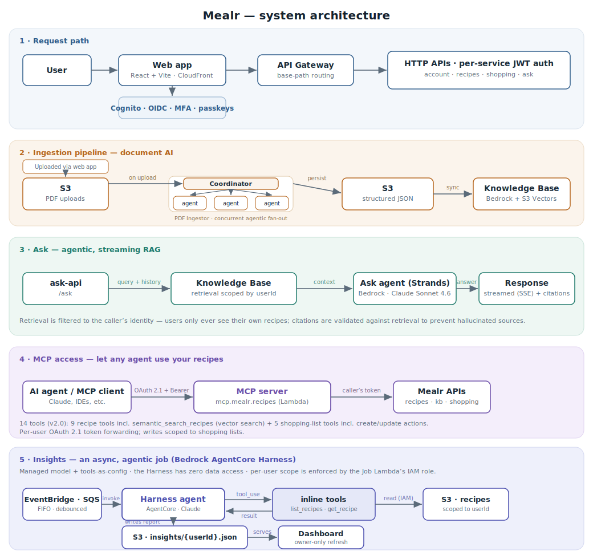
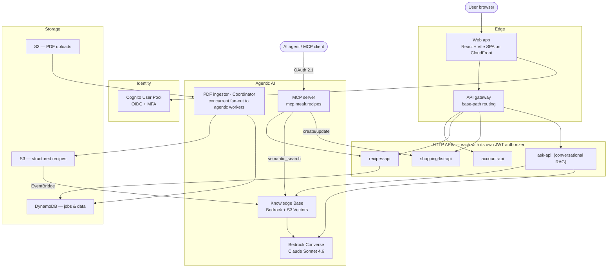

# Mealr — an agentic AI recipe platform

> **Case study / architecture showcase.** This repository documents the design of Mealr, a production serverless platform with conversational AI over a user's own recipes. The application source is private; this repo exists to walk through the architecture and the agentic-AI engineering behind it.

Built and architected by **Derrick Bryant** — [LinkedIn](https://www.linkedin.com/in/derrick-bryant) · [GitHub](https://github.com/dbryant4)

---

## Contents

- [What it is](#what-it-is)
- [The agentic AI, in depth](#the-agentic-ai-in-depth)
  - [Conversational RAG over personal data](#conversational-rag-over-personal-data-ask-service)
  - [Vector knowledge base](#vector-knowledge-base-kb-service)
  - [Document-AI ingestion pipeline](#document-ai-ingestion-pipeline-pdf-ingestor-service)
  - [MCP server for agents](#mcp-server--let-any-agent-use-your-recipes-mcp-service)
- [System architecture](#system-architecture)
- [Tech stack](#tech-stack)
- [Engineering practices on display](#engineering-practices-on-display)
- [My role](#my-role)

---

## What it is

Mealr turns a pile of scanned recipe PDFs into a private, searchable, **conversational** cookbook. Upload a photo or PDF of a recipe and an ingestion pipeline extracts it into structured data; ask questions in plain English ("what can I make with what's in the fridge?", "add the Tuesday pasta to my shopping list") and a retrieval-grounded assistant answers using **only your own recipes**, with citations.

It's a full multi-service platform — auth, APIs, a React web app, a static marketing site, an event-driven ingestion pipeline, a Bedrock-backed knowledge base, and an MCP server for external agents — deployed entirely as serverless infrastructure-as-code.

---

## The agentic AI, in depth

This is the part that matters for an engineering audience. Mealr isn't a chatbot bolted onto a CRUD app — retrieval, grounding, and per-user isolation are designed in.

### Conversational RAG over personal data (`ask` service)
- **An agentic, streaming assistant** built on the **Strands Agents** framework over **Amazon Bedrock** (Claude Sonnet 4.6) with a **Knowledge Base** — a tool-using agent that streams its answer token-by-token over **SSE**, rather than one blocking call.
- **Multi-turn chat** — the client sends conversation history each turn; threads persist client-side.
- **Per-user retrieval scoping** — retrieval is filtered to the caller's identity (`userId` metadata), so one user can never retrieve another's recipes. Shared-library access is an explicit, granted exception (`ownerSub`).
- **Grounded citations** — when the answer references specific recipes, the response includes structured citations (`slug`, `title`, `snippet`, `url`), validated against what retrieval actually returned. Chit-chat and irrelevant retrieval hits are deliberately *not* cited.
- **Structured tool-style output** — a separate `listRecipes` field returns only positive matches the model recommends for shopping, kept distinct from display citations and validated against retrieval — reducing hallucinated recommendations.

### Vector knowledge base (`kb` service)
- Converts each structured recipe into a Markdown document plus a Bedrock metadata sidecar.
- Maintains a shared **Bedrock Knowledge Base backed by Amazon S3 Vectors**, with `userId` metadata for filtered retrieval.
- **Event-driven sync** via EventBridge, with debouncing when many recipes change at once.

### Document-AI ingestion pipeline (`pdf-ingestor` service)
- Drop a scanned recipe PDF in S3 → an event-driven pipeline extracts it into structured JSON (ingredients with consistent units, steps, images), scoped by `userId`.
- **Agentic extraction, deterministic writes:** a **Coordinator** fans out concurrent **agentic recipe workers** — each running Bedrock Converse with the source PDF inlined as a document block — over a **FIFO queue**, preserving per-user ordering and backing off adaptively when Bedrock throttles. The workers only *extract*; the Coordinator then runs a **deterministic persist chain** (validate → write the tagged `recipe.json` → archive the source → merge the per-user index) that does all the S3 writes, keeping the fuzzy AI step cleanly separated from durable persistence. Page and banner images render in parallel.
- Job status tracked in DynamoDB for the UI; idempotent reprocessing and data migrations are first-class.

### MCP server — let any agent use your recipes (`mcp` service)
- A remote **Model Context Protocol** server (FastMCP on AWS Lambda) that lets external AI agents — Claude, IDE assistants, anything MCP-aware — work with a user's recipes through standard tools.
- **Fourteen tools across two groups (v2.0):**
  - *Recipes (9, read-only)* — `list_recipes`, `get_recipe`, `get_recipe_json`, `get_recipe_metadata`, `search_recipes`, **`semantic_search_recipes`** (vector search over a user's indexed recipes, ranked by relevance), `list_import_batches`, `list_recipe_shares`, `get_kb_indexing_status`.
  - **Retrieval as a composable tool (v2.0 change):** the server now exposes *semantic search* rather than a canned Q&A answer — the *calling* agent reasons over the ranked results. Cleaner boundary: the MCP provides capabilities; the client's agent orchestrates. (Replaced the earlier `ask_about_recipes` tool.)
  - *Shopping lists (5, incl. write actions)* — `list_shopping_lists`, `get_shopping_list`, and the action tools `create_shopping_list`, `add_recipes_to_shopping_list`, `update_shopping_list`: an agent can **plan meals and build or modify a shopping list**, with ingredients auto-aggregated and grouped by category.
- **Deliberate permission boundary:** recipes stay read-only; write access is scoped to shopping lists — an agent can *act*, but only where it's safe to.
- **Agent-grade auth:** OAuth 2.1 with PKCE against the existing Cognito user pool — serves OAuth discovery metadata, returns `401` with `WWW-Authenticate` for unauthenticated calls, and proxies authorize/token to Cognito, with per-platform app clients.
- **Clean boundary:** runs on its own custom domain (`mcp.mealr.recipes`), separate from the REST gateway; each tool forwards the caller's own Bearer token to the underlying service (`recipes-api`, `kb-api`, `shopping-list-api`) — so an agent only ever sees and changes what that user can.

---

## System architecture

Three flows — the request path, the document-AI ingestion pipeline, and the conversational-RAG ask flow.

Text version (Mermaid)

---

## Tech stack

| Area | Choices |
|---|---|
| **AI** | Amazon Bedrock (Converse + Knowledge Bases), Amazon S3 Vectors, Claude Sonnet 4.6, Strands Agents (streaming Ask), Model Context Protocol (FastMCP) |
| **Compute** | AWS Lambda, Step Functions, EventBridge, SQS (serverless, event-driven) |
| **Data** | DynamoDB, S3 |
| **Auth** | Amazon Cognito (OIDC, MFA); OAuth 2.1 + PKCE for MCP clients |
| **Web** | React, Vite, TypeScript, Tailwind, TanStack Query, react-oidc-context |
| **APIs** | HTTP APIs with per-stack JWT authorizers; OpenAPI specs |
| **Infra** | AWS CDK (Python) — 100% infrastructure-as-code, multi-stack |
| **Quality** | pytest test suites, generated API docs, per-service semantic versioning |

---

## Engineering practices on display

- **Microservices done deliberately** — nine independently deployable services, each with its own stack, authorizer, OpenAPI contract, tests, and SemVer version, wired together through an API gateway and EventBridge.
- **Security & multi-tenancy** — Cognito OIDC + MFA, JWT authorizers per service, and retrieval that is *provably* scoped per user.
- **Event-driven, idempotent pipelines** — debounced KB sync, overflow buffering, reprocessing, and data migrations treated as first-class concerns.
- **Everything as code** — all infrastructure in CDK; reproducible deploys; architecture captured in a versioned diagram checked into the repo.

---

## My role

I designed and built the entire platform end to end — the agentic AI (RAG design, retrieval scoping, grounding and citation validation, the document-extraction pipeline, and an MCP server that exposes recipes to external agents over OAuth 2.1), the serverless architecture, the APIs and auth, and the React front-end. Mealr is where I prove the thing I care about professionally: bringing **agentic AI into production reliably**, not just as a demo.

---

*Source code is private. This repository is a design write-up; reach out if you'd like a deeper walkthrough.*
